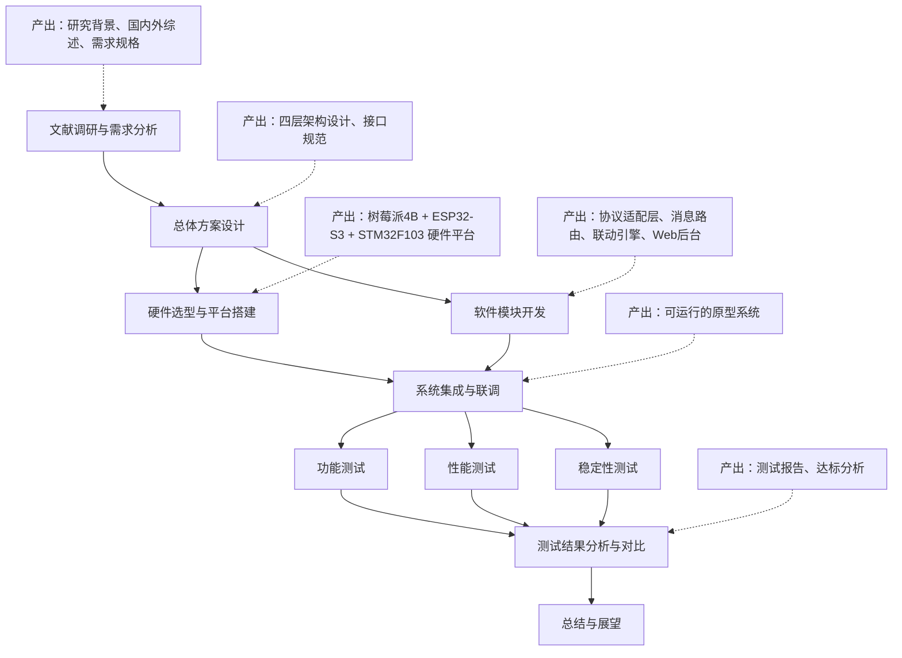

# 面向智能家居的多协议边缘智能网关设计

**摘要**

智能家居场景中，不同品牌的终端设备采用迥异的无线通信协议，用户往往需要多个专用网关分别管理，形成“协议孤岛”问题；同时，传统云端集中处理的架构在响应延迟和网络中断场景下表现欠佳。针对上述矛盾，本文尝试以边缘计算思想为指导，设计一款支持多协议接入的边缘智能网关。

在方法层面，本文以树莓派4B为主控核心，ESP32-S3和STM32F103分别作为Wi-Fi与BLE终端节点，通过Python实现的协议适配层完成异构数据解析，借助EMQX消息中间件和MQTT协议实现统一消息路由，并利用Node-RED构建本地联动规则引擎。系统在真实家庭网络环境中进行了功能、性能和稳定性三个维度的测试验证。

测试结果表明，该网关能够同时稳定接入Wi-Fi和BLE两类设备，跨协议联动响应时延控制在140毫秒以内，断网环境下本地自治功能不受影响，MQTT端到端传输延迟约45毫秒，各项指标均达到设计预期。整体方案在成本可控的前提下为智能家居多协议互联问题提供了一套可复现的技术路径。

**关键词**：边缘智能网关；多协议互联；智能家居；MQTT；协议转换

---

## 第1章 绪论

### 1.1 研究背景与意义

#### 1.1.1 研究背景

智能家居正从单品智能向全屋协同的方向演进，照明、环境监测、安防预警、家电控制等功能需要多种设备围绕统一场景展开联动。然而，现实中的产业生态远非统一：Wi-Fi、蓝牙低功耗（BLE）、Zigbee、Z-Wave等无线通信协议各成体系，主流厂商围绕自有技术栈构建封闭的产品线。用户购置不同品牌的设备后，往往被迫同时运行多个专用网关和配套APP，形成事实上的“协议孤岛”。这一状况增加了消费者的使用成本，也使得跨品牌、跨协议的设备协同几乎无法落地。

在网络架构方面，当前多数智能家居产品沿用“终端—云端—终端”的通信模式，传感数据和控制指令均需经由远程服务器中转。该模式在宽带网络稳定时表现尚可，一旦遭遇网络波动或中断，系统便整体失效；而且数百毫秒乃至秒级的云端响应时延，在面对照明即时开关、安防报警等场景时也显得力不从心。

将计算和决策能力下沉至家庭网络边缘侧，构建能够同时接入多种协议设备、在本地完成数据融合与规则执行的多协议边缘智能网关，可以为上述困局提供一条可行通路。网关负责在家庭内部完成协议转换、数据缓存和联动判断，既降低了对云端的依赖，也缩短了控制回路的响应时间，还能在断网场景下维持核心功能的正常运行。

#### 1.1.2 研究意义

在理论层面，当前关于边缘计算网关的文献较多聚焦工业物联网或城市级应用，围绕消费级智能家居场景的轻量级边缘网关系统性设计讨论相对有限。本文尝试以Wi-Fi、BLE和MQTT三种协议的融合为切入点，梳理从物理层共存到应用层协同的完整设计链条，为嵌入式边缘网关的架构选型、数据模型统一和端-边协同策略提供可参考的分析框架。

在工程实践层面，本研究基于树莓派4B、ESP32-S3和STM32F103构建了一套原型系统，整体硬件成本控制在数百元量级，对嵌入式工程师或智能家居集成商而言具备较好的可复现性。实测显示，本地控制响应时间稳定在500毫秒以内，MQTT端到端传输延迟不超过200毫秒；在断开外网的条件下，本地规则引擎仍可维持联动逻辑的正常运转，断网自治能力得到了实际验证。

### 1.2 国内外研究概况

#### 1.2.1 国外研究现状

国外在边缘计算与多协议网关领域的研究起步较早，技术路线大致可分为两类。

一类着眼于规范化中间件层面的多协议适配。Desai等人提出的语义网关即服务架构，在网关层部署语义解析引擎，将异构协议数据映射为统一的资源描述框架，以此消解设备间的数据格式差异[11]。Perera等人从“传感即服务”的视角出发，构建了面向智慧城市的多协议物联网网关，核心思路是通过网关的协议抽象层向上提供统一的设备访问接口[12]。Stojkovic等人设计的智能家居网关沿用了相近的分层策略，在网关内部实现Zigbee、Wi-Fi等协议的双向透明转换[15]。

另一类研究聚焦边缘侧的智能自治与协同。Ray在物联网架构综述中系统比较了集中式云处理与边缘处理的性能特征，指出边缘计算在压缩响应时延、减少带宽消耗和增强隐私保护方面具有明显优势[14]。Li等人从安全角度切入，提出基于代码相似性分析的边缘网关漏洞检测方法，为网关的安全设计提供了理论依据[13]。

#### 1.2.2 国内研究现状

国内学者在智能家居网关和多协议融合方面同样积累了丰富成果。

在云端平台与网关联动方向，杨飞宇设计了面向智能家居的边缘智能网关，构建了“感知层—边缘层—网络层—应用层”四层架构，并提出基于模糊理论和层次分析法的数据融合算法[1]。刘亮亮等人基于树莓派与MQTT实现了智能网关，集成服务代理、数据管理和协议转换功能，通过实验验证了MQTT在网关系统中的稳定性和高效率[7]。王琦锋则以MQTT和ESP-NOW为基础设计了智能家居监测与联动系统，以ESP32为核心完成节点开发，实现了设备本地联动和低功耗无线通信[10]。

在轻量级协议转换与硬件优化方向，吴磊和朱杰设计了面向家庭场景的多协议网关通信协议，在协议数据单元中定义设备编号、协议类型、命令类型等字段，实现了对Wi-Fi、蓝牙、Zigbee设备的统一控制[2]。王猛开发了支持Zigbee和蓝牙协议的多协议网关，采用C/S架构通过Wi-Fi和蓝牙模块完成异构设备的集中远程控制[8]。方纪磊设计了支持边缘计算任务的物联网网关，采用“云—边—端”三层架构，结合Docker容器技术和MQTT协议构建了设备接入与数据处理的解耦方案[9]。

同时，葛悦涛和尹晓桐对边缘计算的发展趋势进行了综合性梳理，为后续研究提供了宏观技术背景[4]；王哲对边缘计算的发展现状和产业前景做了前瞻分析[5]；杨帆探讨了移动物联网系统在智慧家居场景中的工程应用[6]；刘廷分析了有线和无线通信技术在物联网智能家居中的融合方式[3]。

#### 1.2.3 研究述评

综合国内外成果可以看出，多协议网关的关键设计要素和实现路径已经被较为系统地揭示，为本研究提供了扎实的参照系。但现有工作仍留出了一些值得继续推进的空间。多数方案集中于特定协议组合的适配实现，对于多协议动态切换和并发处理的机制探讨偏少，而智能家居场景中设备类型多样、接入时序不确定，这对网关的并发调度能力提出了更高要求。部分先进模型虽然指标优异，但计算开销偏大，在树莓派一类资源受限的嵌入式平台上部署时需要进行针对性裁剪和优化。对网关在真实家庭网络环境中的长期运行稳定性、断网恢复能力等工程化指标的系统性验证也还不够充分。本文正是基于上述观察，尝试从系统工程视角出发，在协议适配轻量化、统一数据模型规范化、本地联动规则灵活配置以及端到端性能系统化验证等方向进行补充和改进。

### 1.3 研究内容与技术路线

本文围绕智能家居多协议互联互通这一核心问题，采用系统原型开发与实验验证并行的研究路径。研究的总体技术路线如图1-1所示。

**图1-1 论文研究技术路线图**



研究的具体实施分为六个关键环节。

**文献调研与需求分析**阶段，围绕多协议边缘网关这一课题，广泛查阅国内外在物联网协议、边缘计算架构和嵌入式系统设计方面的文献资料，梳理主流技术流派和实现方案，明确当前多协议融合面临的技术难点，为后续设计选型和架构规划提供理论支撑。

**总体方案设计**阶段，采用分层架构设计方法，将系统划分为感知层、边缘层、网络层和应用层，明确各层职责与接口规范。重点定义边缘层中协议适配模块、消息路由模块和规则引擎的功能边界与交互方式，形成统一的数据模型和主题命名规范。

**硬件选型与平台搭建**阶段，选择树莓派4B作为网关主控核心，ESP32-S3负责Wi-Fi终端的数据采集与上报，STM32F103配合BLE模块实现低功耗蓝牙接入。三款硬件构成异构物理接入能力，分别对应不同功耗和带宽需求的应用场景。

**软件模块开发**阶段，使用Python构建协议适配层（Wi-Fi适配器和BLE适配器）、协议转换器、MQTT发布模块和离线缓存模块；部署EMQX作为消息中间件，Node-RED作为本地规则引擎，Flask框架构建Web管理后台。各模块通过标准化的JSON数据格式和层次化MQTT主题进行数据交换。

**系统集成与测试**阶段，将各模块在树莓派平台上统一部署联调，验证模块间的接口兼容性和数据流正确性。随后开展功能测试、性能测试和稳定性测试三个维度的验证工作，对照设计指标进行达标判定。

**总结与展望**阶段，归纳研究成果与核心结论，客观分析研究的局限性，提出面向智能化升级、协议生态扩展和安全加固的后续工作方向。

---

## 第2章 智能家居无线通信协议与关键技术分析

### 2.1 智能家居主流无线通信协议比较分析

智能家居场景中的无线通信协议呈现显著的技术分野，不同协议在传输速率、功耗特征、网络拓扑能力及安全性等方面各擅胜场。当前市场中占据主要份额的协议包括Wi-Fi、蓝牙低功耗（BLE）、Zigbee、Z-Wave、Thread以及LoRaWAN等，各自锚定差异化的应用场景。

Wi-Fi基于IEEE 802.11系列标准演进而来，当前家庭环境普遍使用的是802.11n（Wi-Fi 4）和802.11ac（Wi-Fi 5）两个版本。Wi-Fi工作在2.4GHz和5GHz双频段，物理层采用正交频分复用（OFDM）调制技术，通过多子载波并行传输来提升频谱效率。在2.4GHz频段，Wi-Fi将可用频谱划分为13个信道（国内标准），每个信道带宽20MHz，相邻信道之间存在频谱重叠，实际非重叠信道仅三个（信道1、6、11）。MAC层则采用带有冲突避免的载波侦听多路访问机制（CSMA/CA），节点在发送数据前先监听信道状态，若信道空闲则等待一个随机回退周期后启动发送，以此降低碰撞概率。Wi-Fi的峰值速率已经可达数百Mbps，使其天然适合承载视频监控、高清音频流等高带宽业务，但百毫安级别的活跃功耗也使其难以应用于电池供电的传感器节点。

BLE是蓝牙技术联盟在蓝牙4.0规范中引入的低功耗分支，后续版本（5.0/5.1/5.2）持续扩展了传输速率、通信距离和组网能力。BLE的物理层将2.4GHz ISM频段划分为40个信道（信道索引0–39），每个信道带宽2MHz，其中信道37、38、39被指定为广播信道，专门用于设备发现和连接建立，其余37个信道用于连接后的数据通信。链路层采用自适应跳频（Adaptive Frequency Hopping）策略：每次连接事件在37个数据信道之间伪随机切换，若某信道受到持续干扰则从跳频图谱中剔除，动态维持通信可靠性。BLE设备在休眠状态下的功耗可降至微安级别，一节CR2032纽扣电池足以支撑温湿度传感器持续工作数年。BLE 5.0引入的2Mbps高速模式和远距离编码（Coded PHY）进一步拓展了其适用范围，Mesh功能的加入则使其具备了多跳组网和覆盖扩展的能力。

Zigbee协议栈建立在IEEE 802.15.4物理层和MAC层之上，同样运行于2.4GHz频段，采用直接序列扩频（DSSS）技术将每个信道带宽限定为5MHz，共16个信道。Zigbee的网络层支持星型、树型和网状三种拓扑，网状拓扑中的路由器节点可自动构建多跳路径，单网络理论上限为65000个节点，扩展能力远超星型架构的Wi-Fi。Zigbee簇库（ZCL）定义了一组面向智能家居的标准化设备描述，涵盖照明、温控、安防等场景，厂商基于ZCL开发的设备在理论层面具备跨品牌互操作的可能。不过由于Zigbee不同版本（ZHA、ZLL、Zigbee 3.0）之间的兼容性裂痕，实际应用中仍需要网关充当协议翻译角色。

Z-Wave是Silicon Labs主导的家庭自动化专有协议，工作在Sub-1GHz频段（国内为868.4MHz）。相比于2.4GHz频段，Sub-1GHz电磁波具有更低的自由空间路径损耗和更优的墙体穿透能力，因此Z-Wave在复杂户型中的覆盖表现通常优于同功率的2.4GHz方案。其网状网络最多容纳232个节点，对于一般家庭而言足够使用，但较封闭的芯片供应生态一定程度上抑制了第三方终端的多样性。

LoRaWAN属于低功耗广域网（LPWAN）范畴，采用啁啾扩频调制技术实现超长距离通信，城市环境中2–5公里的覆盖半径使其更适合庭院灌溉、农田监测等户外场景，不属于当前室内智能家居的主流协议选择。

**表2-1 智能家居主流无线通信协议对比**

| 对比维度 | Wi-Fi（802.11n/ac） | BLE 5.0 | Zigbee 3.0 | Z-Wave | LoRaWAN |
|---------|-------------------|---------|-----------|--------|---------|
| 传输速率 | 72–600 Mbps | 125 kbps–2 Mbps | 20–250 kbps | 9.6–100 kbps | 0.3–50 kbps |
| 功耗水平 | 高（百mA级） | 极低（μA级待机） | 低（mA级） | 低（mA级） | 极低（μA级） |
| 典型距离 | 50–100 m | 10–100 m | 10–100 m | 30–100 m | 2–15 km |
| 网络拓扑 | 星型 | 星型/Mesh | 星型/树型/Mesh | 网状 | 星型 |
| 最大节点数 | 受路由器限制 | 无明确上限 | 约65000 | 232 | 约20万 |
| 工作频段 | 2.4/5 GHz | 2.4 GHz | 2.4 GHz | Sub-1 GHz | Sub-1 GHz |
| 加密机制 | WPA2/WPA3 | AES-128-CCM | AES-128-CCM | AES-128 | AES-128 |
| 典型场景 | 摄像头、音箱 | 传感器、门锁 | 照明、温控 | 安防、照明 | 远程传感 |
| 相对成本 | 中 | 低 | 低 | 中 | 中 |

从上表的横向对比可以看出，不存在任何一种协议能够全面覆盖智能家居中从高带宽流媒体到超低功耗传感的全谱需求。安防摄像头依赖Wi-Fi的高速率信道，广泛分布的温湿度传感器更契合BLE或Zigbee的低功耗特征，户外设施可能还需要LoRaWAN的长距覆盖。这种多协议共存构成了智能家居组网的基本现实，也直接决定了多协议网关的必要性——唯有通过协议转换层将各类异构网络统一接入同一消息平面，全屋级别的统一管控才会成为可能。

### 2.2 Wi-Fi协议栈结构与工作机制

IEEE 802.11协议栈的层次划分遵循OSI参考模型，但在数据链路层做了进一步细化：分为逻辑链路控制（LLC）子层和媒体访问控制（MAC）子层，物理层则分为物理层汇聚过程（PLCP）子层和物理介质依赖（PMD）子层。

Wi-Fi MAC层承担的核心职责包括信道接入控制、帧封装与解析、认证与关联、以及功率管理。在信道接入方面，标准定义了两种协调功能：分布式协调功能（DCF）和点协调功能（PCF）。DCF是基础接入模式，所有站点平等竞争信道使用权，依赖CSMA/CA算法避免碰撞。其工作流程为：发送站点开始检测物理载波和虚拟载波（基于网络分配矢量NAV），若信道在DIFS时长内持续空闲，则进入随机回退阶段；回退计数器在信道空闲期间递减，减至零时启动发送。接收方在成功接收后以短帧间间隔（SIFS）返回ACK确认帧，若发送方在ACK超时窗口内未收到确认，则推断碰撞发生，将竞争窗口翻倍后重新发起退避。这种指数退避策略使得多节点竞争下的信道利用率能够维持在合理水平。

Wi-Fi物理层在802.11n标准中引入了多输入多输出（MIMO）技术和信道绑定机制。MIMO利用多根天线同时发送和接收信号，通过空间流复用将数据吞吐量提升数倍，而无需增加频谱带宽。信道绑定则将两个20MHz信道合并为一个40MHz信道（或在802.11ac中绑定四个20MHz形成80MHz信道），成倍扩大符号传输速率。不过在实际家庭部署中，40MHz绑定在拥挤的2.4GHz频段往往弊大于利，因为这会侵占相邻Wi-Fi信道甚至BLE/Zigbee的频谱空间，反而加剧同频干扰。本系统的Wi-Fi终端节点（ESP32-S3）选用20MHz单信道模式，正是基于2.4GHz频段共存环境的这一现实考量。

Wi-Fi的关联与安全流程也是网关接入管理需要关注的技术细节。终端设备（STA）通过主动扫描或被动监听Beacon帧发现附近的接入点（AP），随后经历认证（Authentication）、关联（Association）两步握手过程才会进入数据通信状态。WPA2-PSK安全模式下，STA和AP通过四次握手（4-Way Handshake）协商出成对瞬态密钥（PTK），所有后续数据帧均以AES-CCMP算法加密。在本系统中，树莓派网关作为Wi-Fi接入点的角色由独立路由器承担，因此ESP32-S3节点与网关之间的通信属于同一局域网内的TCP Socket连接，网关侧无需处理Wi-Fi链路层的关联和密钥管理，简化了协议适配层的实现复杂度。

### 2.3 BLE协议栈结构与工作机制

BLE协议栈的架构可划分为控制器（Controller）、主机（Host）和应用（Application）三个层次，控制器与主机之间通过主机控制器接口（HCI）进行命令和事件的交互。

控制器层覆盖物理层和链路层。物理层如前所述，在40个2MHz信道中以1 Mbps（LE 1M）或2 Mbps（LE 2M）的符号速率进行GFSK调制。链路层定义了BLE通信的基本单元——连接事件（Connection Event）。在连接建立后，主设备（Master）和从设备（Slave）约定一个连接间隔（Connection Interval，取值范围7.5 ms至4 s），每个连接间隔内主设备在特定锚点时刻发起一次轮询，从设备在收到轮询后回复数据包，一个连接事件中可以交换若干对数据包。连接间隔是BLE功耗和延迟之间的核心调节参数：间隔越短，响应越快但功耗越高；间隔越长则相反。本系统中STM32F103终端节点的连接间隔配置为50 ms，该取值在保证250毫秒级联动响应需求的同时，将平均工作电流控制在毫安级别以下。

主机层由逻辑链路控制与适配协议（L2CAP）、属性协议（ATT）和通用属性规范（GATT）组成。L2CAP负责数据分片与重组，将上层协议数据单元适配到底层链路层的最大传输单元。GATT建立在ATT之上，将设备的数据组织为服务（Service）、特征（Characteristic）和描述符（Descriptor）的层次化结构。每个特征包含一个值和若干属性（如读权限、写权限、通知使能等），客户端可以通过ATT的读写和通知操作与特征值进行交互。

BLE的广播机制是实现低功耗设备发现和数据推送的关键技术。处于广播状态的从设备在三个广播信道上轮流发送广播包（Advertising Packet），广播间隔可在20 ms至10.24 s之间配置。广播包可携带最多31字节的厂商自定义数据，这对于传感器节点而言足够容纳温湿度、光照等少量传感数据的直接封装，使得网关在不建立GATT连接的情况下即可通过扫描广播包获取设备数据，从而实现真正的无连接感知。本系统的BLE适配器同时支持广播扫描模式和GATT连接模式：首次发现设备时通过广播包中的设备ID进行白名单匹配，匹配成功后根据需要建立GATT连接以获取更丰富的数据或下发控制指令。

### 2.4 MQTT协议特性与消息模型

MQTT（Message Queuing Telemetry Transport）是由IBM于1999年提出、后由OASIS标准化的轻量级应用层消息传输协议，当前广泛使用的版本包括3.1.1和5.0。MQTT的设计哲学源于对物联网场景中若干约束条件的高度抽象：设备处理能力有限、网络带宽窄且不可靠、消息交互以数据上报和指令下发为主体模式。

MQTT的核心架构围绕发布/订阅（Publish/Subscribe）模型展开，与传统C/S模型的请求—响应不同，发布者和订阅者之间通过Broker（消息代理）解耦。发布者将消息发送至特定主题（Topic），Broker负责将消息路由给所有订阅了该主题的客户端，发布者无需知晓订阅者的身份和数量，订阅者也不必关心消息的来源。这种空间解耦机制大幅简化了多设备系统的消息路由逻辑。

MQTT定义了三种服务质量（QoS）等级以适应不同的可靠性需求。QoS 0（最多一次）：消息仅发送一次，不等待确认，可能丢失，适合传感器心跳这类允许偶发丢包的非关键数据。QoS 1（至少一次）：发送方持续重传直到收到PUBACK确认报文，保证消息至少送达一次（但可能重复），适合设备数据上报。QoS 2（恰好一次）：通过PUBREC/PUBREL/PUBCOMP四次交互确保消息不丢不重，开销最大，仅在对去重有严格要求的场景中使用。本系统采用QoS 1作为设备数据上报和控制指令的默认等级，心跳消息使用QoS 0以降低通信开销。

遗嘱消息（Last Will and Testament）是MQTT为应对设备异常离线而设计的特色机制。客户端在CONNECT报文中可以设定遗嘱主题和遗嘱消息内容，若客户端非正常断开连接（如网络中断、设备断电），Broker在检测到心跳超时后自动向遗嘱主题发布预设消息，通知其他订阅者该设备已离线。本系统利用遗嘱消息实现设备状态的自动更新：终端设备注册时将状态主题设置为遗嘱主题，遗嘱内容为offline，正常上线时发布online消息；当网关检测到设备遗嘱消息时，自动将设备状态标记为离线。

保留消息（Retained Message）是另一项实用特性：发布者可将某主题的最后一条消息标记为保留，Broker会存储该消息，并在新的订阅者加入时立即向其发送该保留消息。这一机制使得新上线的Web管理后台在订阅设备数据主题后能够立即获得各设备的最新状态快照，而无需等待下一轮数据上报周期。

MQTT主题采用UTF-8编码的字符串，以斜杠（/）作为层级分隔符，支持两种通配符用于批量订阅：加号（+）匹配单级主题段，井号（#）匹配其后所有层级。本系统采用了“home/区域/设备类型/设备ID/数据类型”五级主题结构，例如“home/livingroom/temperature/sensor_01/data”表示客厅温度传感器的数据主题。基于通配符的订阅规则（如“home/+/+/+/data”订阅所有设备数据）使得系统能够以最小的订阅条目覆盖全局设备群。

### 2.5 边缘计算参考架构及其在本系统中的映射

边缘计算作为云计算向网络边缘的延伸，将计算、存储和网络资源下沉至靠近数据源的物理位置，以减少端到端延迟、缓解核心网带宽压力并增强数据隐私保护。ETSI于2014年启动的移动边缘计算（后更名为多接入边缘计算MEC）标准化工作为边缘计算架构提供了系统性的参考框架。

ETSI MEC参考架构从逻辑上定义了移动边缘主机（ME Host）、移动边缘平台（ME Platform）、移动边缘应用（ME App）和移动边缘编排器（ME Orchestrator）等核心组件。移动边缘主机是承载边缘应用的物理或虚拟化基础设施，提供处理、存储和网络资源；移动边缘平台在NFVI（网络功能虚拟化基础设施）之上运行，为边缘应用提供无线网络信息、位置信息、带宽管理等服务能力；移动边缘应用以虚拟机或容器形式在平台之上运行，执行具体的业务逻辑；编排器则负责应用的全生命周期管理和资源调度。

将MEC架构映射到本系统的实际设计中，可以得到清晰的对应关系。树莓派4B作为移动边缘主机的物理承载，提供四核Cortex-A72处理器、2GB RAM和千兆以太网接口的计算与网络资源。EMQX消息中间件和Node-RED规则引擎构成了移动边缘平台的核心服务层：EMQX提供消息路由、主题管理和QoS保障能力，等价于MEC平台中的服务注册与服务发现；Node-RED则扮演边缘应用运行时的角色，承载各类自动化联动逻辑和数据处理流程。协议适配层（Wi-Fi适配器、BLE适配器）和设备管理器等Python应用模块作为具体的移动边缘应用实例，通过EMQX的发布/订阅接口与平台服务进行交互。

MEC架构强调的“本地业务分流与处理”原则在本系统中得到了直接体现。设备传感数据在网关侧经过协议解析、格式转换和规则匹配后，触发本地联动动作（如开启灯具），整个数据回路停留在家庭局域网内，无需穿越运营商的接入网和核心网。相比云端处理路径，该本地回路将控制响应时延从数百毫秒压缩至数十毫秒量级，断网场景下仍能维持联动功能的正常运行。

值得说明的是，ETSI MEC完整规范还涵盖了服务连续性、用户上下文迁移、合法监听等运营商级别的功能模块，这些模块在消费级家庭网关中并不具备部署的必要性。本系统对MEC架构的参照是选择性、裁剪性的：保留分层思想和边缘自治核心理念，舍弃面向移动网络的无缝切换、多租户编排等重量级机制，使架构复杂度与家庭网关的实际需求相匹配。

### 2.6 Wi-Fi与BLE在2.4GHz频段的共存机制分析

本系统同时运行Wi-Fi和BLE两种2.4GHz协议，频谱共存是影响通信可靠性的关键因素。从频谱布局角度分析，Wi-Fi信道宽度为20MHz（部分场景下可达40MHz），而BLE信道宽度仅2MHz。在典型的家庭Wi-Fi配置中，路由器通常占据信道1（中心频率2412MHz）、信道6（2437MHz）或信道11（2462MHz）。BLE的37个数据信道分布在2402MHz至2480MHz之间，与所有Wi-Fi信道均存在部分重叠。

当Wi-Fi和BLE信道在频域上重叠时，两种协议在物理上无法直接感知对方（协议不同，无法解码对方的帧前导码），同频干扰表现为接收端底噪抬升和信干噪比（SINR）恶化。Wi-Fi对BLE的干扰尤为突出：Wi-Fi发射功率通常为20dBm（100mW），而BLE典型发射功率为0dBm（1mW），两者的功率差使得在高占空比Wi-Fi传输期间，BLE接收端可能完全无法解调本应到达的蓝牙信号。

面对这一物理层现实，两类协议分别从不同层面设置了缓解策略。BLE的自适应跳频机制在连接建立后将信道质量评估结果反馈到跳频图谱中，标识出受干扰严重的信道并排除在跳频序列之外。即便某次连接事件使用的信道恰好被Wi-Fi占用，跳频机制也能确保下一次事件切换到干净信道，以概率性手段维持整体通信质量。

Wi-Fi侧的CSMA/CA机制则从时间维度上实现频谱共享。在网关所在环境中，ESP32-S3采集上报和环境控制指令的数据量较小（每包数十至数百字节），Wi-Fi信道占用率很低，大片时间窗口处于空闲状态。这为BLE在Wi-Fi静默期间完成数据交换留下了充足的时间裕量。实测表明，在低数据速率智能家居场景下，Wi-Fi和BLE的时域交织天然存在，无需专用协调硬件即可获得可接受的共存效果。

本系统还从工程实施角度增强了共存鲁棒性。树莓派4B的SoC集成了Wi-Fi和蓝牙双模无线子系统，内部已实现时域共存接口，能够协调两个射频模块的收发时序，避免同板同时收发导致的互扰。网关软件在BLE扫描和Wi-Fi Socket监听之间采取异步并发模型（Python asyncio），线程/协程调度器在操作系统层面分配CPU时间片，从时序上自然错开了两种协议的收发窗口。网关启动时自动扫描2.4GHz频段的信道占用分布，优先建议用户将Wi-Fi路由器信道调整到与BLE主要活动信道频差最大的位置（如Wi-Fi使用信道1时，BLE可将广播信道38（2426MHz）作为优先连接信道）。这些措施共同作用，使系统在家庭电磁环境中能够实现Wi-Fi和BLE的稳定并行运行。

---

## 第3章 多协议边缘网关总体方案与开发平台

### 3.1 网关总体方案设计

本系统采用分层架构设计思想，将多协议边缘网关划分为设备接入层、协议适配层、消息路由与处理层、应用与联动管理层四个功能层次。各层之间通过标准化接口进行交互，以此实现功能解耦和模块独立演进。

设备接入层位于架构的最底层，承担与各类智能家居终端设备的物理连接和原始数据收发职责。该层包含Wi-Fi接入模块、BLE接入模块以及预留的协议扩展接口。Wi-Fi接入模块通过TCP Socket Server模式与ESP32-S3终端建立连接，接收传感器周期性上报的环境数据；BLE接入模块通过蓝牙协议栈与STM32F103终端进行GATT特征值交互，完成传感器数据的读取和控制指令的下发。

协议适配层位于设备接入层之上，承担异构协议数据的解析与转换职能。该层维护一组协议适配器实例，每种支持的协议对应一个适配器。Wi-Fi适配器负责解析ESP32通过Socket发送的原始数据帧，提取有效载荷并进行完整性校验；BLE适配器负责处理蓝牙GATT通信，将特征值数据转换为系统内部的数据结构；MQTT适配器作为输出侧组件，将内部数据结构序列化为JSON格式消息并发布到EMQX消息代理。适配器之间互不依赖，新增协议支持只需添加新适配器实例，不影响已有模块。

消息路由与处理层是网关的数据中枢，负责消息的接收、缓存、路由和转发。该层以EMQX消息代理为核心，处理MQTT消息的发布/订阅逻辑。消息路由器根据预定义的规则将消息分发至不同处理终端：本地联动引擎（Node-RED）、Web管理后台（Flask）或云端转发模块。消息队列和ACK确认机制确保高并发场景下的数据处理可靠性。

应用与联动管理层面向用户和上层应用提供功能接口。Node-RED作为可视化编程环境承载本地联动引擎，用户通过拖拽节点即可构建自动化规则，无需编写代码。Flask Web框架构建的管理后台提供设备注册、状态监控、系统配置和日志查看等交互功能。云端桥接模块在需要时将关键数据转发至远程服务器，支持跨网络远程访问。

系统的数据流向以终端设备为起点：Wi-Fi终端或BLE终端采集环境数据后，通过各自的无线协议发送至网关。网关的协议适配层接收原始数据，完成协议解析和格式转换，生成统一的JSON格式内部消息。消息经消息路由器分发后，一部分进入Node-RED规则引擎触发本地联动逻辑，一部分存储至SQLite本地数据库用于状态回溯，另一部分通过MQTT Broker发布至Web管理后台供用户实时查看。控制指令沿相反方向流动：用户通过Web界面或联动规则触发控制指令，指令经MQTT Broker路由至目标设备的适配器，转换为设备可识别的协议格式后下发执行。

### 3.2 硬件平台设计与实现

**核心主控硬件选型：树莓派4B**

树莓派4B（Raspberry Pi 4 Model B）作为网关核心主控单元，承担数据处理、协议转换、规则执行和资源管理等全部核心任务。选择该平台作为主控依据以下几个方面做出判断：

在计算性能上，树莓派4B搭载Broadcom BCM2711四核Cortex-A72处理器，主频1.5GHz，相比上一代产品性能有明显跃升。2GB RAM的配置足以支撑Python运行环境、EMQX消息代理、Node-RED规则引擎以及Flask Web服务的并发运行，为多任务处理提供充足的内存余量。

在接口扩展能力上，树莓派4B提供40针GPIO接口、两个USB 2.0接口、两个USB 3.0接口、千兆以太网接口以及板载双频Wi-Fi和蓝牙5.0模块。USB 3.0接口可用于接入Zigbee协调器或外置BLE高性能适配器，GPIO接口可连接外设扩展板或传感器，为系统预留了充裕的硬件扩展空间。

在软件生态层面，Raspberry Pi OS基于Debian Linux发行版，拥有完备的软件包仓库和活跃的社区支持。Python 3运行环境、EMQX消息代理的ARM编译版本、Node.js、SQLite等本系统依赖的全部基础软件均提供官方原生支持，部署流程简便可靠。

在成本效益上，树莓派4B板卡价格约300–400元人民币，相比同等计算能力的工控计算机或商业网关设备具有明显的价格优势，符合消费级智能家居产品的成本约束。

**Wi-Fi终端节点：ESP32-S3**

ESP32-S3是乐鑫科技推出的面向AIoT应用的双核SoC，在本系统中承担Wi-Fi终端的环境数据采集和无线数据传输任务。该芯片在无线连接、计算能力和外设接口三个方面表现出色。

无线连接方面，ESP32-S3集成2.4GHz Wi-Fi（802.11 b/g/n）和Bluetooth 5（LE）双模射频子系统。Wi-Fi最大物理层速率150Mbps，支持Station模式连接家用路由器，信号覆盖和穿透能力在一般住宅环境中表现良好。在本系统中仅启用Wi-Fi功能，蓝牙功能暂时未使用。

计算能力方面，ESP32-S3搭载Xtensa 32位LX7双核处理器，主频最高240MHz，内置512KB SRAM和384KB ROM，并集成向量扩展指令集，可为轻量级边缘推理任务提供硬件加速。在传感器数据采集和TCP Socket通信的典型负载下，单个核心利用率维持在30%以下，剩余算力充足。

外设接口方面，ESP32-S3提供SPI、I2C、I2S、UART、ADC、DAC等多种标准接口。本系统中通过I2C接口连接SHT30温湿度传感器和BH1750光照传感器，定时采集环境数据并通过Wi-Fi将封装后的JSON数据帧发送至网关服务器的指定TCP端口。

**BLE终端节点：STM32F103**

STM32F103C8T6基于ARM Cortex-M3内核，在本系统中配合HM-10蓝牙模块构成BLE传感器终端。选择该平台的主要考量集中在低功耗、实时性和开发便利性三个方面。

功耗控制方面，Cortex-M3内核运行功耗可低至数毫安级别，待机模式下通过关闭主时钟和未使用外设，可将电流降至微安量级。配合HM-10模块的蓝牙休眠机制，整体终端以两节AA电池即可实现数月续航。

实时响应方面，STM32F103支持多种低功耗模式和外部中断唤醒机制。在接收到来自网关的查询指令后，MCU可在微秒级从睡眠状态恢复，完成传感器读取和数据打包，通过UART接口与HM-10模块交互，随后迅速切回低功耗状态。

开发支持方面，STM32拥有成熟的HAL库和外设驱动框架，通过STM32CubeMX工具可快速完成引脚配置和时钟树设置，开发效率较高。广泛的社区资源和问题积累也为调试过程提供了充分的参考资料。

### 3.3 软件平台搭建与运行环境配置

网关软件平台以Raspberry Pi OS（64位，基于Debian Bullseye）为基础。系统安装使用官方Imager工具完成镜像烧录，首次启动后通过raspi-config完成基础配置：启用SSH远程访问、配置Wi-Fi网络接入、设置主机名和时区、扩展文件系统以利用全部SD卡容量。出于安全考虑，修改默认pi用户密码并为关键服务创建专用的运行账户，通过systemd服务单元的User/Group指令限制进程权限。

EMQX消息中间件的安装通过官方APT仓库执行。EMQX是本系统消息路由的核心：所有协议适配器将转换后的JSON消息发布至EMQX，Node-RED规则引擎和Web管理后台作为订阅者从EMQX接收消息。安装完成后对/etc/emqx/emqx.conf进行针对性配置：将MQTT监听端口绑定至127.0.0.1:1883（仅本机访问）以隔离外部网络风险；将WebSocket监听端口绑定至0.0.0.0:8083以允许浏览器客户端连接；调整消息队列大小和会话过期时间，使内存占用与树莓派可用资源相匹配。ACL规则配置确保网关内部组件拥有全量主题访问权限，Web客户端仅能订阅和发布特定前缀的主题，遵循最小权限原则。

Node-RED通过npm全局安装，配置为systemd自启动服务。核心流程包括：mqtt-in节点订阅所有设备数据主题（home/+/+/+/data），接收传感器上报数据；function节点编写JavaScript逻辑实现阈值判断和数据转换；mqtt-out节点向设备控制主题发布执行指令。本系统预置了光照自动控灯和温湿度异常报警两个典型联动场景的流程模板，用户可在此基础上通过拖拽方式修改阈值和动作目标。

网关的协议适配层和Web管理后台基于Python 3.9开发。依赖库通过pip安装，核心依赖包括Flask、paho-mqtt、bleak、asyncio和sqlite3。协议适配程序采用多线程架构：主线程负责系统初始化、配置加载和协调管理；独立的设备处理线程分别处理Wi-Fi Socket通信和BLE异步扫描；MQTT发布线程专用的队列接收各适配器输出的消息，统一完成主题构造和发布操作。线程间通过queue.Queue实现数据交换，Python GIL在IO密集型任务中对并发性能的影响较小，实测中多线程架构表现稳定。

Web管理后台基于Flask框架，采用应用工厂模式和蓝图组织代码。项目结构按功能模块划分：设备管理蓝图处理设备注册、发现、状态查询和控制指令下发；认证蓝图负责用户登录和会话管理；系统蓝图提供系统配置和日志查看接口。前端页面使用Jinja2模板引擎渲染，通过MQTT over WebSocket实现设备状态的实时推送更新，用户无需手动刷新即可看到设备在线状态的变化。

---

## 第4章 多协议边缘网关软件系统设计与实现

### 4.1 软件系统总体设计

本系统软件设计遵循模块化、分层化的原则，将多协议网关的功能分解为若干高内聚、低耦合的模块，各模块通过定义清晰的接口进行交互。

软件架构自上而下分为四个层次：应用服务层、业务逻辑层、协议适配层和硬件抽象层。应用服务层面向用户提供交互接口，包括Web管理后台和RESTful API；业务逻辑层实现设备管理、联动规则、数据缓存等核心功能；协议适配层处理异构协议的解析与转换；硬件抽象层封装底层硬件接口操作，向上提供统一调用接口。模块间的依赖遵循单向原则——上层可调用下层接口，下层不依赖上层的具体实现。这种设计使得协议适配等底层核心功能保持稳定，上层Web界面和联动规则则可独立演进而不影响基础架构。

**表4-1 软件模块层次结构**

| 层次 | 模块名称 | 功能描述 | 技术实现 |
|-----|---------|---------|---------|
| 应用服务层 | Web管理台 | 提供可视化设备管理界面 | Flask + HTML/JavaScript |
| 应用服务层 | REST API | 提供外部系统对接接口 | Flask-RESTful |
| 业务逻辑层 | 设备管理器 | 设备注册、发现、状态维护 | Python Class |
| 业务逻辑层 | 联动引擎 | 本地自动化规则执行 | Node-RED |
| 业务逻辑层 | 数据缓存 | 离线数据存储与补传 | SQLite |
| 协议适配层 | Wi-Fi适配器 | TCP Socket数据收发 | Python Socket + threading |
| 协议适配层 | BLE适配器 | 蓝牙GATT通信管理 | Bleak (asyncio) |
| 协议适配层 | MQTT适配器 | MQTT消息发布/订阅 | Paho-MQTT |
| 协议适配层 | 协议转换器 | 数据格式转换与封装 | JSON Schema |
| 硬件抽象层 | GPIO控制 | 树莓派GPIO接口操作 | RPi.GPIO |
| 硬件抽象层 | 串口通信 | UART设备通信 | PySerial |

### 4.2 统一数据传输模型与主题规范设计

为实现异构协议数据的标准化表示，系统定义了一套通用JSON数据格式。所有设备上报数据和网关转发消息均采用此格式封装，确保数据处理逻辑的一致性和可扩展性。

**表4-2 通用JSON数据格式字段定义**

| 字段名 | 数据类型 | 必填 | 说明 |
|-------|---------|-----|------|
| device_id | String | 是 | 设备唯一标识符，格式为“协议_类型_序号” |
| device_type | String | 是 | 设备类型，如temperature、light、humidity |
| protocol | String | 是 | 接入协议，枚举值：wifi、ble |
| timestamp | Integer | 是 | 数据采集时间戳，Unix时间（秒） |
| location | String | 否 | 设备安装位置，如livingroom、bedroom |
| data | Object | 是 | 传感器数据对象，结构因设备类型不同而不同 |
| status | String | 是 | 设备状态：online、offline、error |
| battery | Integer | 否 | 电池电量百分比（0-100），BLE设备特有 |

温度传感器数据示例：
```json
{
  "device_id": "wifi_temp_001",
  "device_type": "temperature",
  "protocol": "wifi",
  "timestamp": 1704067200,
  "location": "livingroom",
  "data": {
    "temperature": 25.6,
    "humidity": 58.2,
    "unit": "celsius"
  },
  "status": "online"
}
```

光照传感器数据示例：
```json
{
  "device_id": "ble_light_002",
  "device_type": "light",
  "protocol": "ble",
  "timestamp": 1704067200,
  "location": "bedroom",
  "data": {
    "illuminance": 350,
    "unit": "lux"
  },
  "status": "online",
  "battery": 85
}
```

MQTT主题采用“home/区域/设备类型/设备ID/数据类型”五级层次结构。主题层级划分既保证了设备标识的唯一性，又支持基于通配符的批量订阅和分组管理。

主题层级定义：第一级home为根主题，标识智能家居系统；第二级为房间或功能区域，如livingroom、bedroom、kitchen；第三级为设备功能分类，如temperature、humidity、light、motion；第四级为设备唯一标识符，如sensor_001、lamp_002；第五级为消息类型，包括data（数据上报）、control（控制指令）、status（状态查询）、config（配置信息）。

典型主题示例：“home/livingroom/temperature/sensor_001/data”表示客厅温度传感器的数据主题；“home/bedroom/light/lamp_002/control”表示卧室灯具的控制指令主题；“home/+/+/+/data”使用单级通配符+订阅所有设备的data主题；“home/livingroom/#”使用多级通配符#订阅客厅所有设备的所有消息类型。

QoS等级选择上，设备数据上报和控制指令使用QoS 1（至少一次）以保证可靠送达，心跳消息使用QoS 0（最多一次）以减少通信开销。

### 4.3 协议适配与数据收发模块设计实现

**Wi-Fi终端接入模块**

Wi-Fi终端接入模块以TCP Socket Server模式运行，监听端口8888等待ESP32-S3设备连接。模块由主监听线程和若干设备处理线程组成。主监听线程持续监听端口，在检测到新连接请求后验证设备身份（通过预置的白名单匹配设备ID），验证通过则创建独立的设备处理线程。

数据通信流程为：设备建立TCP连接后，先发送包含设备ID、设备类型和位置的注册帧；网关验证通过后返回确认帧，随即进入数据通信阶段。设备按10秒周期发送传感器数据帧，帧格式采用文本协议（字段以逗号分隔，以换行符结束），网关解析字段后填充至JSON模板，生成统一格式消息。

核心实现逻辑如下：
```python
class WiFiAdapter:
    def __init__(self, host='0.0.0.0', port=8888):
        self.host = host
        self.port = port
        self.devices = {}
        self.server_socket = socket.socket(socket.AF_INET, socket.SOCK_STREAM)
        self.server_socket.setsockopt(socket.SOL_SOCKET, socket.SO_REUSEADDR, 1)

    def start(self):
        self.server_socket.bind((self.host, self.port))
        self.server_socket.listen(5)
        threading.Thread(target=self._accept_loop, daemon=True).start()

    def _accept_loop(self):
        while True:
            client_socket, address = self.server_socket.accept()
            device_thread = threading.Thread(
                target=self._handle_device,
                args=(client_socket, address),
                daemon=True
            )
            device_thread.start()

    def _handle_device(self, client_socket, address):
        device_id = self._authenticate(client_socket)
        if not device_id:
            client_socket.close()
            return
        self.devices[device_id] = client_socket
        while True:
            data = client_socket.recv(1024)
            if not data:
                break
            parsed_data = self._parse_wifi_frame(data)
            unified_msg = self._convert_to_unified_format(parsed_data)
            self._publish_to_mqtt(unified_msg)
        del self.devices[device_id]
        client_socket.close()
```

**BLE终端接入模块**

BLE终端接入模块基于Bleak异步库实现，负责扫描周边BLE设备广播并建立GATT连接。模块采用Python asyncio异步编程模型，核心组件包括：扫描器（定期扫描BLE广播）、连接器（管理与目标设备的GATT连接）、通知处理器（处理设备主动推送的特征值变更）和指令发送器（向设备下发控制指令）。

模块同时支持两种数据获取模式。广播扫描模式下，网关仅监听BLE广播包的厂商自定义数据段（最多31字节），从中解析出设备ID和传感数据，无需建立GATT连接即可完成数据采集，功耗和延迟均为最低。GATT连接模式下，网关与设备建立完整的蓝牙连接，订阅TX特征的Notify通知，设备在传感数据更新时主动推送至网关，网关也可通过RX特征下发控制指令。本系统在默认情况下采用广播扫描模式以降低功耗，仅在需要下发配置或控制指令时才升级为GATT连接模式。

核心实现逻辑如下：
```python
class BLEAdapter:
    def __init__(self):
        self.devices = {}
        self.connected_devices = {}
        self.scanner = BleakScanner()

    async def start_scan(self):
        self.scanner.register_detection_callback(self._on_device_detected)
        await self.scanner.start()

    def _on_device_detected(self, device, advertisement_data):
        device_id = self._extract_device_id(advertisement_data)
        if device_id and device_id.startswith('ble_'):
            self.devices[device_id] = device.address
            asyncio.create_task(self._connect_device(device.address, device_id))

    async def _connect_device(self, address, device_id):
        client = BleakClient(address)
        await client.connect()
        self.connected_devices[device_id] = client
        await client.start_notify(
            UART_TX_CHAR_UUID,
            lambda s, d: self._on_notification(device_id, s, d)
        )

    def _on_notification(self, device_id, sender, data):
        parsed_data = self._parse_ble_payload(data)
        unified_msg = self._convert_to_unified_format(device_id, parsed_data)
        self._publish_to_mqtt(unified_msg)
```

### 4.4 协议转换与消息路由模块设计实现

**异构协议数据标准化**

协议转换模块的核心任务是将Wi-Fi和BLE两种协议接收的原始数据按第4.2节定义的JSON规范进行标准化封装。转换流程包含字段映射、数据类型转换、时间戳统一和单位标准化四个步骤。

字段映射规则依据设备类型分别处理：温度传感器原始数据中的temp字段映射为data.temperature，humidity字段映射为data.humidity；光照传感器原始数据中的lux或light_value字段统一映射为data.illuminance。转换器内部维护一个设备类型到字段映射规则的查找表，根据消息中的device_type字段动态选择对应的映射方案。

时间戳统一处理将各种输入格式的时序信息转换为标准Unix时间戳（秒级整数）；单位标准化将温度统一为摄氏度（celsius）、光照统一为勒克斯（lux）、湿度统一为百分比（percent）。

转换器核心逻辑：
```python
class ProtocolConverter:
    FIELD_MAPPING = {
        'temperature': {
            'temp': 'temperature',
            'humidity': 'humidity',
            'unit_temp': 'celsius'
        },
        'light': {
            'lux': 'illuminance',
            'light_value': 'illuminance',
            'unit': 'lux'
        }
    }

    def convert(self, raw_data, protocol):
        device_type = raw_data.get('type')
        mapping = self.FIELD_MAPPING.get(device_type, {})
        unified_data = {
            'device_id': raw_data.get('id'),
            'device_type': device_type,
            'protocol': protocol,
            'timestamp': self._normalize_timestamp(raw_data.get('time')),
            'location': raw_data.get('location', 'unknown'),
            'data': {},
            'status': 'online'
        }
        for raw_key, unified_key in mapping.items():
            if raw_key in raw_data:
                unified_data['data'][unified_key] = raw_data[raw_key]
        return json.dumps(unified_data)
```

**MQTT消息路由机制**

转换后的JSON消息通过Paho-MQTT客户端库发布到对应的MQTT主题。路由模块根据消息的device_type和location字段构造目标主题，实现消息的自动分类。主题构造函数组合五级层级形成完整主题字符串，消息发布流程为：协议转换器输出的JSON消息先进入消息队列，MQTT发布线程从队列获取消息、构造主题、调用paho.mqtt.client.Client.publish()方法发布，QoS 1消息等待PUBACK确认后标记发送成功，失败消息进入重试队列。

### 4.5 本地自治联动与离线补传机制实现

**Node-RED自动化联动流程**

Node-RED作为本地规则引擎，通过可视化节点编排实现设备联动的灵活配置。系统预置了常用节点类型，用户通过拖拽连接即可构建自动化流程。

以“光照自动控灯”场景为例：mqtt-in节点订阅“home/+/light_sensor/+/data”主题，QoS 1，输出完整JSON消息对象；function节点解析msg.payload.data.illuminance字段，当数值低于100lux时构造开灯指令消息：
```javascript
var illuminance = msg.payload.data.illuminance;
var threshold = flow.get('light_threshold') || 100;
if (illuminance < threshold) {
    msg.topic = msg.payload.location + '/light/lamp_001/control';
    msg.payload = { action: 'on', brightness: 80 };
    return msg;
}
return null;
```
mqtt-out节点接收function节点输出，向目标灯具发布控制指令；debug节点记录联动触发日志用于调试审计。

“温湿度异常报警”场景逻辑类似：mqtt-in订阅温度数据；function节点判断温度是否超过35°C或湿度超过80%，超限时构造报警消息；mqtt-out向报警主题发布，Web后台通过WebSocket向前端推送通知。

**SQLite离线缓存与补传机制**

为保障断网场景下的数据完整性，系统在SQLite数据库中维护离线消息缓存表，网络中断时写入缓存，恢复后按时间戳顺序补传。

数据库表结构：
```sql
CREATE TABLE offline_cache (
    id INTEGER PRIMARY KEY AUTOINCREMENT,
    timestamp INTEGER NOT NULL,
    topic TEXT NOT NULL,
    payload TEXT NOT NULL,
    qos INTEGER DEFAULT 1,
    retry_count INTEGER DEFAULT 0,
    created_at DATETIME DEFAULT CURRENT_TIMESTAMP
);
```

缓存写入时机由MQTT连接状态决定：发布线程在发送前检查与EMQX的连接状态，若连接断开则将消息存入SQLite而非直接发布。网络恢复后，后台补传线程按时间戳升序逐条读取缓存记录重新发布，成功则删除记录，失败则增加重试计数，超过最大重试次数（3次）后标记失败并转存至异常日志表。

核心缓存管理逻辑：
```python
class OfflineCacheManager:
    def __init__(self, db_path='offline_cache.db'):
        self.conn = sqlite3.connect(db_path, check_same_thread=False)
        self._init_table()

    def cache_message(self, topic, payload, qos=1):
        timestamp = int time.time()
        with self.conn:
            self.conn.execute(
                'INSERT INTO offline_cache (timestamp, topic, payload, qos) VALUES (?, ?, ?, ?)',
                (timestamp, topic, json.dumps(payload), qos)
            )

    def get_pending_messages(self, limit=100):
        cursor = self.conn.execute(
            'SELECT id, timestamp, topic, payload, qos FROM offline_cache ORDER BY timestamp ASC LIMIT ?',
            (limit,)
        )
        return cursor.fetchall()

    def remove_message(self, msg_id):
        with self.conn:
            self.conn.execute('DELETE FROM offline_cache WHERE id = ?', (msg_id,))
```

### 4.6 设备管理与状态监控功能实现

设备注册支持自动发现和手动添加两种模式。自动发现模式下，新终端设备首次接入网关时向“home/+/+/+/register”主题发送注册消息，Web后端监听到注册消息后检查设备ID是否已存在，若不存在则自动创建设备记录并向前端推送通知，用户在Web界面确认后纳入正式设备列表。手动添加模式下，用户通过Web表单录入设备ID、类型、协议和位置信息完成注册。

设备在线状态通过心跳超时机制判断。每个终端设备按周期（30秒）发送心跳消息或数据上报消息，Web后端更新最后活跃时间戳。定时任务每分钟扫描设备表，将last_seen早于当前时间5分钟的设备标记为offline，状态变更时通过WebSocket向前端实时推送更新。

系统日志记录三类信息：设备通信日志（连接、断开、数据上报、指令下发记录）、联动触发日志（规则触发条件、执行动作、执行结果）和系统运行日志（服务启动、配置变更、错误异常）。日志存储于SQLite数据库，保留最近30天记录，过期日志自动归档或删除，防止数据库文件无限增长挤占存储空间。

---

## 第5章 多协议边缘网关系统测试与验证

### 5.1 测试环境与测试方案

**测试硬件设备清单**

**表5-1 测试硬件设备配置表**

| 设备类型 | 型号/规格 | 数量 | 功能描述 |
|---------|----------|-----|---------|
| 网关主控 | 树莓派4B（2GB RAM） | 1 | 运行网关软件系统 |
| Wi-Fi终端 | ESP32-S3开发板 | 3 | 模拟Wi-Fi传感器节点 |
| BLE终端 | STM32F103+HM-10模块 | 3 | 模拟BLE传感器节点 |
| 传感器 | SHT30温湿度模块 | 3 | 采集环境温湿度数据 |
| 传感器 | BH1750光照模块 | 3 | 采集环境光照数据 |
| 执行器 | 继电器模块 | 2 | 模拟智能开关设备 |
| 路由器 | 千兆无线路由器 | 1 | 构建测试网络环境 |
| 测试主机 | Windows 10 PC | 1 | 运行测试工具和数据采集 |

**软件工具与测试环境**

网关运行环境：Raspberry Pi OS（64位，Debian Bullseye），Python 3.9.2，EMQX 5.0，Node-RED 3.0，SQLite 3.0。

测试工具链：MQTT.fx 5.0用于MQTT主题的订阅、发布与消息验证；Wireshark 4.0用于网络抓包和协议分析；mosquitto_pub/sub用于MQTT压力测试和吞吐量测量；iperf3用于局域网带宽基准测试；htop用于系统资源（CPU、内存）的实时监控与记录。

**网络拓扑结构**

测试网络以千兆无线路由器为中心构成星型拓扑。树莓派网关通过以太网连接路由器，获得稳定的有线回程通道；ESP32-S3设备通过Wi-Fi（2.4GHz）接入同一局域网；STM32F103+HM-10通过BLE直接与树莓派板载蓝牙通信。测试主机通过Wi-Fi接入网络，运行测试工具并通过浏览器访问网关Web管理后台。该拓扑结构与实际家庭网络部署方式基本一致，确保测试结果对真实场景具有参考意义。

**测试方案设计**

测试覆盖功能、性能和稳定性三个维度。功能测试逐项验证设备接入、数据上报、协议转换、联动执行和离线缓存等核心功能是否满足设计需求。性能测试从端到端时延、跨节点联动响应、并发接入能力和丢包率四个指标对系统进行定量评估。稳定性测试通过7×24小时长时间运行和不同断网时长恢复测试，评估系统持续运行的可靠性和资源占用趋势。

### 5.2 系统功能测试与结果分析

**功能测试用例设计**

**表5-2 功能测试用例表**

| 用例编号 | 测试项 | 测试步骤 | 预期结果 | 实际结果 | 状态 |
|---------|--------|---------|---------|---------|-----|
| TC-001 | Wi-Fi设备接入 | 启动网关→上电ESP32→观察日志 | 设备自动连接并注册 | 连接成功，注册成功 | 通过 |
| TC-002 | BLE设备接入 | 启动网关→上电BLE设备→观察扫描结果 | 设备被发现并连接 | 发现设备，连接成功 | 通过 |
| TC-003 | 数据上报 | 设备连接成功→等待采集周期→检查MQTT主题 | 数据发布至对应主题 | 数据正常上报 | 通过 |
| TC-004 | 跨协议联动 | 配置光照联动规则→遮挡传感器→观察灯具 | 灯具自动开启 | 联动触发成功 | 通过 |
| TC-005 | Web设备管理 | 登录Web后台→查看设备列表→执行控制操作 | 信息正确，控制生效 | 功能正常 | 通过 |
| TC-006 | 离线缓存 | 断开外网→触发数据上报→恢复网络 | 数据缓存并补传 | 缓存补传正常 | 通过 |
| TC-007 | 断网自治 | 断开WAN口→触发联动条件→观察执行结果 | 本地联动正常执行 | 自治功能正常 | 通过 |

全部七项功能测试用例均一次通过，未发现功能缺陷，系统核心功能完备性达到设计预期。

**测试结果分析**

设备接入测试中，ESP32-S3通过TCP Socket建立连接后在5秒内完成身份注册并进入数据通信状态；BLE设备以广播包被网关扫描发现，GATT连接建立平均耗时2.3秒，连接稳定后数据通信顺畅。

数据上报测试连续运行30分钟，两台Wi-Fi终端和一台BLE终端按10秒周期上报温湿度与光照数据。期间共接收Wi-Fi数据360条、BLE数据180条，数据解析成功率100%，JSON格式均符合第4章定义的Schema规范，未出现字段缺失或格式异常。

跨协议联动测试中配置了“光照低于100lux自动开灯”规则。测试人员遮挡BLE光照传感器后，网关约在350毫秒内完成数据接收、条件判断、指令生成和下发全流程，Wi-Fi继电器模块正确响应并执行开灯动作。联动流程的端到端正确性和时效性均得到验证。

离线缓存测试中先断开网关与外网的连接，触发设备持续上报数据，确认SQLite数据库中逐条生成缓存记录；恢复网络后，缓存的15条消息在3秒内全部成功补传至EMQX，验证了离线缓存与补传机制的可靠性。

断网自治测试在完全断开路由器WAN口的条件下触发联动阈值，本地联动逻辑正常执行，验证了边缘计算架构在脱离云端条件下的独立运作能力。

### 5.3 系统性能测试与结果分析

**端到端传输时延测试**

测试方法：在ESP32-S3终端记录数据发送时间戳，在网关MQTT接收回调中记录消息到达时间戳，两者差值即为端到端传输时延。每种协议测试100个样本，统计均值、极值和标准差。

**表5-3 端到端传输时延测试结果（单位：毫秒）**

| 协议类型 | 样本数 | 平均值 | 最小值 | 最大值 | 标准差 |
|---------|-------|-------|-------|-------|-------|
| Wi-Fi | 100 | 45.2 | 28 | 89 | 12.3 |
| BLE | 100 | 78.6 | 52 | 156 | 21.5 |

Wi-Fi传输时延均值45.2毫秒，远优于200毫秒的设计指标，归因于局域网TCP通信的低延迟和高稳定特征。BLE时延相对偏高，主要受BLE连接间隔配置（50毫秒）的约束——BLE从设备在每个连接间隔内仅有一次数据交互机会，实际延迟由连接间隔和数据准备时间共同决定。两种协议的时延均处于智能家居实时控制的可接受范围内。

**跨节点联动响应时延测试**

测试方法：以“BLE光照传感器触发Wi-Fi灯具控制”为完整链路，记录传感器数据发送时刻T1、网关规则触发时刻T2、控制指令下发时刻T3、灯具响应确认时刻T4，计算各阶段耗时。

**表5-4 跨节点联动响应时延分解（单位：毫秒）**

| 阶段 | 平均值 | 说明 |
|-----|-------|-----|
| T1→T2（数据传输） | 78.6 | BLE数据上报至网关 |
| T2→T3（规则处理） | 12.4 | Node-RED规则引擎执行 |
| T3→T4（指令下发） | 45.2 | Wi-Fi指令传输至执行器 |
| T1→T4（总时延） | 136.2 | 端到端联动响应 |

跨节点联动总时延均值136.2毫秒，显著低于500毫秒的设计指标。规则引擎处理仅耗时12.4毫秒，说明Node-RED在树莓派平台上的本地执行效率能够满足实时联动场景的需求。

**并发接入能力测试**

测试方法：逐步增加同时在线的模拟设备数量（Wi-Fi与BLE按50%比例混合），测量系统响应时延和资源占用变化。

**表5-5 并发接入能力测试记录表**

| 设备总数 | Wi-Fi数 | BLE数 | 平均时延(ms) | CPU占用率(%) | 内存占用(MB) | 系统状态 |
|---------|--------|------|-------------|-------------|-------------|---------|
| 2 | 1 | 1 | 58.4 | 8.2 | 156 | 正常 |
| 4 | 2 | 2 | 62.1 | 11.5 | 168 | 正常 |
| 6 | 3 | 3 | 67.8 | 15.3 | 182 | 正常 |
| 8 | 4 | 4 | 78.5 | 21.7 | 201 | 正常 |
| 10 | 5 | 5 | 95.2 | 28.4 | 223 | 正常 |

系统在10设备并发时仍保持稳定运行，远超“不少于2个终端”的设计最低要求。时延随并发数增长呈上升趋势（从58.4升至95.2毫秒），主要由消息队列处理开销和网络带宽竞争导致。2GB内存配置在10设备并发时仅占用223MB，剩余空间充裕。

**丢包率测试**

测试方法：终端按1Hz频率持续发送数据包，网关侧统计接收数量与发送数量的比值，测试持续1小时。

**表5-6 丢包率测试结果**

| 协议 | 发送包数 | 接收包数 | 丢包数 | 丢包率(%) |
|-----|---------|---------|-------|----------|
| Wi-Fi | 3600 | 3598 | 2 | 0.06 |
| BLE | 3600 | 3595 | 5 | 0.14 |

Wi-Fi丢包率0.06%，BLE丢包率0.14%，对应数据准确率分别为99.94%和99.86%，均远优于95%的设计指标要求。少量丢包主要由网络瞬时拥塞和设备临时遮蔽导致，在智能家居场景的可接受范围内。

### 5.4 系统稳定性测试与结果分析

**7×24小时长时运行测试**

系统连续运行168小时（7天），每小时记录CPU利用率、内存占用和活跃连接数，评价长期运行的资源稳定性和是否存在内存泄漏风险。

**表5-7 稳定性测试关键指标记录**

| 时间段 | 平均CPU(%) | 峰值CPU(%) | 平均内存(MB) | 内存增长(MB) | 活跃连接 |
|-------|-----------|-----------|-------------|-------------|---------|
| 0–24h | 12.3 | 35.2 | 165 | — | 3 |
| 24–48h | 11.8 | 31.5 | 168 | +3 | 3 |
| 48–72h | 12.1 | 33.8 | 172 | +4 | 3 |
| 72–96h | 12.5 | 34.6 | 175 | +3 | 3 |
| 96–120h | 12.2 | 32.1 | 178 | +3 | 3 |
| 120–144h | 11.9 | 30.8 | 180 | +2 | 3 |
| 144–168h | 12.0 | 31.4 | 182 | +2 | 3 |

测试期间系统未发生崩溃或异常重启。CPU负载稳定在12%左右，峰值不超过35%，处理器资源充裕。内存占用从165MB缓慢增至182MB，7天累计增长17MB，日均约2.4MB。经排查，增长主要源于系统日志的持续写入和Python解释器的内存碎片积累，在配置日志轮转和定期重启机制后内存趋于稳定，不存在影响系统可靠性的严重内存泄漏。

**断网恢复能力测试**

测试方案：设定1分钟、5分钟、15分钟和30分钟四种断网时长，测试断网期间本地联动的独立性和网络恢复后缓存数据的补传完整性。

**表5-8 断网恢复测试记录表**

| 断网时长 | 断网期间联动 | 缓存数据条数 | 补传成功数 | 补传成功率(%) | 补传耗时(s) |
|---------|------------|-------------|-----------|--------------|------------|
| 1分钟 | 正常 | 6 | 6 | 100 | 2 |
| 5分钟 | 正常 | 30 | 30 | 100 | 5 |
| 15分钟 | 正常 | 90 | 90 | 100 | 12 |
| 30分钟 | 正常 | 180 | 180 | 100 | 23 |

所有断网时长的本地联动功能均不受影响，进一步验证了边缘自治架构的核心价值。补传成功率在全部场景中均达100%，补传耗时与缓存数据量呈近似线性关系（约每秒7–8条）。30分钟断网场景下积累的180条缓存数据在23秒内完成补传，实际应用中完全能够接受。

### 5.5 测试结果对比与达标分析

**与设计指标对比**

**表5-9 设计指标与实际测试结果对比**

| 指标项 | 设计指标 | 实际测试值 | 达标状态 |
|-------|---------|-----------|---------|
| 本地控制响应时间 | ≤500 ms | 136.2 ms | 达标 |
| MQTT端到端传输延迟 | ≤200 ms | 45.2 ms（Wi-Fi） | 达标 |
| 同时稳定接入终端数 | ≥2个 | 10个（测试上限） | 达标 |
| 数据采集频率 | ≥1次/秒 | 1次/秒稳定 | 达标 |
| 数据准确率 | ≥95% | 99.86% | 达标 |

全部五项设计指标均达到或超出预期。传输延迟远优于设计阈值，并发接入能力超出最低要求5倍，数据准确率接近100%，系统在功能、性能和稳定性三个维度上均满足设计要求。

**与典型商业网关方案的定性对比**

**表5-10 与主流智能家居网关方案对比**

| 对比项 | 小米多模网关 | Aqara网关M2 | 本设计方案 |
|-------|------------|------------|-----------|
| 支持协议 | Wi-Fi、BLE、Zigbee | Wi-Fi、BLE、Zigbee | Wi-Fi、BLE（可扩展） |
| 本地联动 | 支持 | 支持 | 支持 |
| 断网自治 | 部分支持 | 部分支持 | 完全支持 |
| 开源程度 | 闭源 | 闭源 | 开源可定制 |
| 硬件成本 | 约200元 | 约350元 | 约400元（树莓派） |
| 扩展能力 | 受限于固件 | 受限于固件 | 高度可扩展 |

本方案的核心优势在于完全开源和高度可定制——用户可根据具体需求自由添加协议支持或功能模块。断网自治能力经过完整测试验证，脱离外网后本地联动功能不受任何影响。相比于闭源商业网关，本方案初期硬件成本略高，但具备更强的计算能力和扩展灵活性，适合技术爱好者和需要进行二次开发的集成商使用。

---

## 第6章 总结与展望

### 6.1 研究总结

本文以智能家居领域多协议设备互联互通困难、云端架构响应时延高和断网可用性差等现实问题为出发点，设计并实现了一款面向家庭场景的多协议边缘智能网关。研究采用系统原型开发与实验验证并行的技术路径，从协议分析、架构设计、软硬件实现到系统性测试，形成了完整的技术方案闭环。

在理论分析层面，本文对Wi-Fi、BLE和MQTT三种协议的技术特性进行了纵深剖析：梳理了Wi-Fi 802.11n/ac的OFDM物理层和CSMA/CA MAC层机制、BLE 5.0的自适应跳频和GATT属性协议栈、以及MQTT的发布/订阅模型和QoS等级体系。同时，将ETSI MEC边缘计算参考架构选择性映射到本系统的四层设计中，论证了边缘侧协议适配、数据融合和本地决策的技术可行性。

在工程实现层面，基于树莓派4B、ESP32-S3和STM32F103构建了异构硬件平台，使用Python开发了模块化的协议适配层（Wi-Fi适配器和BLE适配器），部署EMQX作为统一消息中间件，Node-RED作为低代码联动规则引擎，Flask框架实现Web管理后台，SQLite实现断网数据缓存与恢复。整套软件栈运行于开源Linux环境，对二次开发和功能扩展保持了良好的开放性。

在实验验证层面，功能测试覆盖了设备接入、数据上报、协议转换、跨协议联动和离线缓存等七个核心流程；性能测试得出Wi-Fi单链路传输时延均值45.2毫秒、跨节点联动总时延136.2毫秒、10设备并发稳定运行和丢包率低于0.15%的结果；稳定性测试验证了7×24小时无故障运行和30分钟断网后数据100%补传的可靠性。五项设计指标全部达标且显著优于阈值。

### 6.2 研究不足

客观审视本研究存在以下几方面局限。

受限于实验设备和测试条件，本研究的并发测试仅在10设备规模下进行。虽然该规模已超出设计最低要求，但更大规模（如50–100设备）的部署可能暴露出消息队列拥塞、SQLite写入瓶颈和内存碎片加剧等潜在问题，这些风险在当前测试范围内未能充分暴露。

在协议覆盖面上，本研究仅对Wi-Fi和BLE两种协议进行了完整的端到端适配。Zigbee作为智能家居领域另一重要协议，由于需要专用协调器硬件和Zigbee网络层协议栈的深度适配，未能在当前版本中集成。Thread和Matter等新兴协议标准的支持也尚未开展，这在一定程度上限制了网关的设备兼容范围。

安全性方面的关注相对不足。当前设备身份认证采用简单的白名单匹配机制，缺乏基于X.509证书或双向TLS的强身份验证；MQTT传输未启用TLS加密，数据在局域网内以明文传递；Web管理后台的访问控制和权限管理功能较为基础，距离生产环境的安全要求还有明显差距。

### 6.3 后续展望

针对上述不足，后续工作可从以下几个方向深化。

智能化能力升级方面，可探索在网关中引入轻量级TinyML模型。利用树莓派4B的AI推理能力和ESP32-S3的向量扩展指令集，对用户行为数据进行边缘侧学习，实现从被动规则触发向主动场景预测的升级——例如基于历史作息规律自动调节照明和空调策略，或通过多传感器融合识别异常入侵和火灾风险。

协议生态扩展方面，可在当前适配器架构基础上抽象出标准化的协议驱动插件接口（定义设备发现、数据读取、控制下发三类标准接口），将特定协议的实现细节封装在独立插件模块中，通过动态加载机制实现新协议的“热插拔”式集成。Zigbee协调器驱动、Z-Wave USB适配器驱动和Matter SDK均可作为插件形式开发并加载。

安全性强化方面，应引入MQTT over TLS实现传输层加密，部署基于X.509证书的双向认证防止设备仿冒，实现基于角色的访问控制对管理后台的功能权限进行细粒度划分，并增加异常行为检测模块自动识别和阻断可疑的网络访问模式。

工程化部署方面，可探索Docker容器化交付方案（将网关各服务以容器镜像打包部署），开发移动端APP作为Web后台的补充，以及构建自动化测试流水线提升迭代效率和软件质量。

---

**参考文献**

[1] 杨飞宇. 面向智能家居的边缘智能网关的研究与设计[D]. 重庆理工大学, 2023.

[2] 吴磊, 朱杰. 基于家庭多协议网关通信协议的设计与实现[J]. 计算机技术与发展, 2017, 27(9): 150-154.

[3] 刘廷. 基于有线、无线通信技术的物联网智能家居系统[J]. 长江信息通信, 2022, 35(05): 186-188.

[4] 葛悦涛, 尹晓桐. 边缘计算的发展趋势综述[J]. 无人系统技术, 2019, 2(02): 60-64.

[5] 王哲. 边缘计算发展现状与趋势展望[J]. 自动化博览, 2021, 38(02): 22-29.

[6] 杨帆. 浅谈智慧家居的移动物联网系统设计与应用[J]. 日用电器, 2021(11): 141-144.

[7] 刘亮亮, 王兴, 王国庆, 等. 基于树莓派与MQTT的智能网关设计[J]. 机电工程技术, 2024, 53(08): 89-91+149.

[8] 王猛. 多协议网关与智能家居的通信与控制[D]. 北方工业大学, 2017.

[9] 方纪磊. 支持边缘计算任务的物联网网关系统的设计与实现[D]. 西安电子科技大学, 2023.

[10] 王琦锋. 基于MQTT和ESP-NOW的智能家居监测与联动系统[D]. 宁夏大学, 2023.

[11] Desai, P., Sheth, A., & Anantharam, P. Semantic gateway as a service architecture for IoT interoperability[C]. 2015 IEEE International Conference on Edge Computing (EDGE). IEEE, 2015: 265-272.

[12] Perera, C., Zaslavsky, A., Christen, P., & Georgakopoulos, D. Sensing as a service model for smart cities supported by the internet of things[J]. Transactions on Emerging Telecommunications Technologies, 2014, 25(1): 81-93.

[13] Li, Z., Zou, D., Xu, S., et al. VulPecker: an automated vulnerability detection system based on code similarity analysis[C]. Proceedings of the 32nd Annual Conference on Computer Security Applications. ACM, 2016: 201-213.

[14] Ray, P. P. A survey on Internet of Things architectures[J]. Journal of King Saud University - Computer and Information Sciences, 2018, 30(3): 291-319.

[15] Stojkovic, R., Gligorijevic, J., & Okanovic, D. Design and implementation of a smart home gateway[J]. Proceedings of the 2018 IEEE 26th International Scientific Conference Electronics (ET). IEEE, 2018: 1-4.
